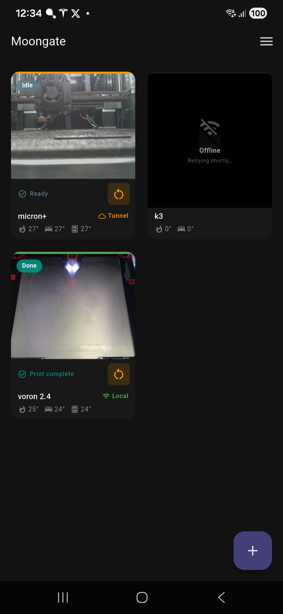
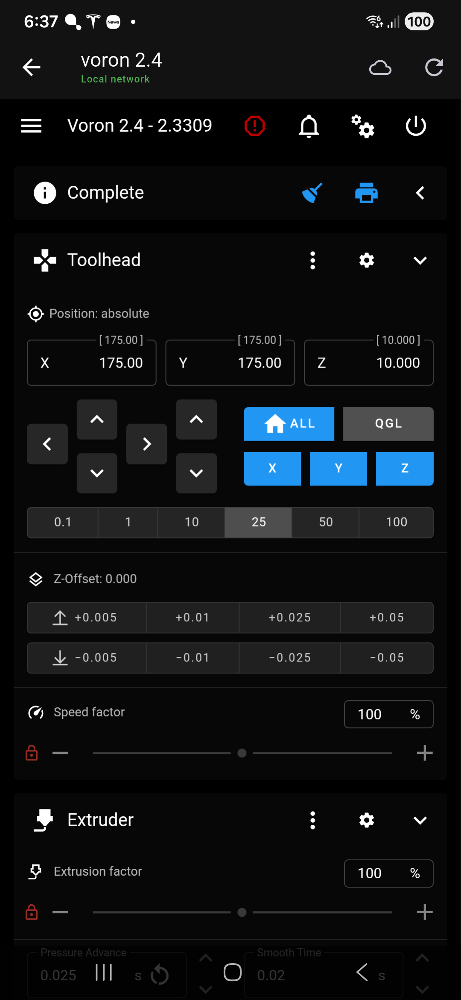
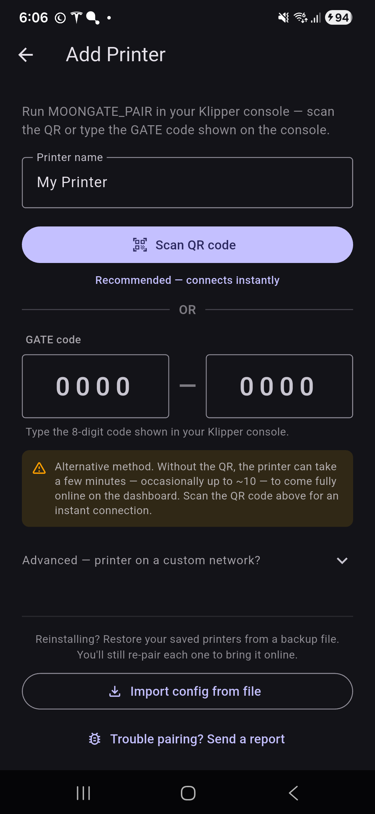
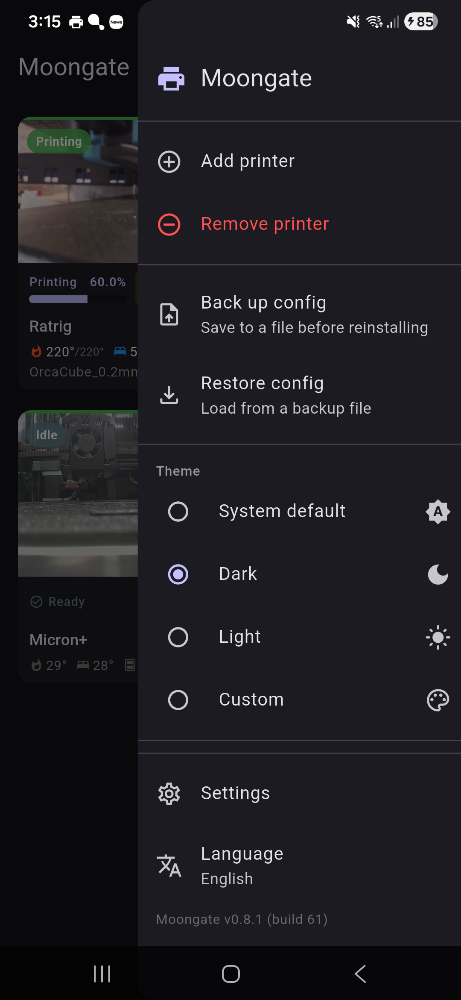
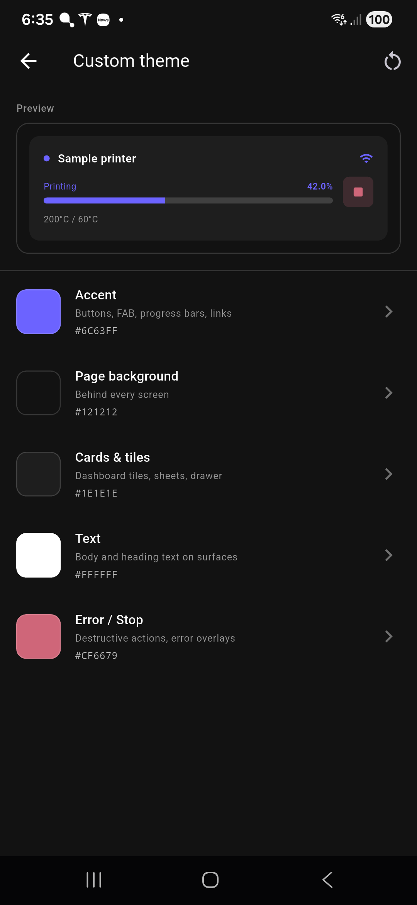
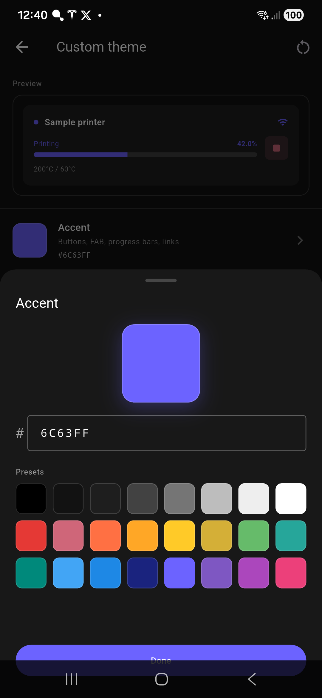
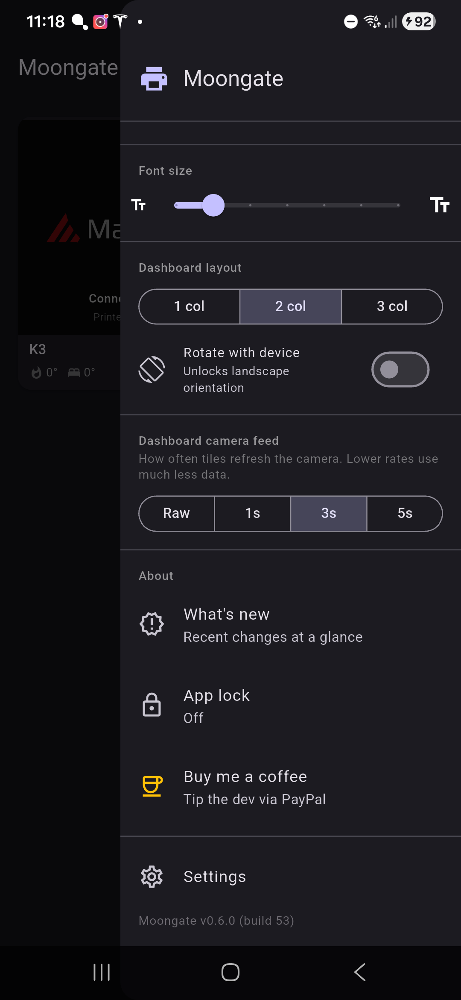

# Moongate

> One app. Your Klipper printer. Anywhere.

Moongate is a free, open-source Android app that gives you a **full remote control interface for your Klipper 3D printer** — live webcam, print controls, temperatures, and the complete Mainsail/Fluidd UI — over your local network and automatically over the internet when you're away from home. No Tailscale. No VPN setup. No subscriptions.

<table align="center">
  <tr>
    <td></td>
    <td></td>
    <td></td>
    <td></td>
  </tr>
</table>

---

## How it works

```
                        ┌──────────────────────┐
                        │   Cloud middleman    │   anonymous sign-in;
                        │   (identity & lookup)│   tells the app where
                        └──────────┬───────────┘   your printer is right now
                                   │ short-lived
                                   │ access token
                                   ▼
   ┌─────────────────┐                  ┌──────────────────────────────┐
   │  Moongate App   │◄──── LAN ───────►│  Raspberry Pi                │
   │   (Android)     │      (home)      │   • Klipper + Moonraker      │
   │                 │◄── Cloudflare ──►│   • Moongate plugin          │
   │                 │   tunnel (away)  │   • Auth proxy — gates every │
   └─────────────────┘                  │     internet-facing request  │
                                        └──────────────────────────────┘
```

Three layers:

1. **Your Raspberry Pi** runs Klipper, Moonraker, the Moongate plugin, and an auth proxy. The proxy sits in front of everything reachable from the internet — any request without a valid, short-lived token gets a flat `401 Unauthorized` with no fingerprint that hints at what's running underneath.

2. **A small cloud middleman** handles anonymous sign-in (no email, no password, nothing to manage) and tells the app where to find your printer right now — the Cloudflare tunnel URL rotates each time the Pi reboots, and the middleman keeps track of the current one. The app fetches a fresh signed access token from the middleman before each request.

3. **The Moongate app** tries your home WiFi first (fast, no internet round-trip), then automatically falls back to the Cloudflare tunnel when you're away. Either path is gated by the same token; either way, your printer commands hit the same plugin on the same Pi.

**The headline:** leaking the tunnel URL alone gives an attacker nothing — every path through the URL returns 401 without revealing what's there.

---

## Setup

### Step 1 — Install the plugin on your Raspberry Pi

SSH into your Pi and run:

```bash
curl -fsSL https://raw.githubusercontent.com/PEEKYPAUL/moongate/master/klipper-plugin/install.sh | bash
```

> **Non-standard HTTP port?** Stock KIAUH / MainsailOS serves Moonraker on port 80 — the installer's default. If your nginx is on a different port (e.g. port 80 is taken by another service, or you're running Moonraker on `8080`), tell the installer:
>
> ```bash
> # Piped install
> MOONGATE_PORT=8080 bash -c "$(curl -fsSL https://raw.githubusercontent.com/PEEKYPAUL/moongate/master/klipper-plugin/install.sh)"
>
> # Or locally:
> curl -fsSL https://raw.githubusercontent.com/PEEKYPAUL/moongate/master/klipper-plugin/install.sh -o install.sh
> bash install.sh --port 8080
> ```
>
> The cloudflared tunnel and the QR pair URL will both use that port. In the app's pair screen, the **Port** field next to the IP is the matching control — leave it blank for 80, fill it in if you used something else here.

This will:
- Clone the Moongate repo to `~/moongate` and symlink the plugin into Moonraker
- Register Moongate with Moonraker's update manager (visible in Mainsail → Software Updates)
- Deploy the QR pairing page to Mainsail
- Install `cloudflared` and start the remote-access tunnel as a systemd service
- Restart Moonraker and Klipper

At the end you'll see output like:

```
  Updates  : Mainsail → Software Updates → Moongate
  Pairing  : http://192.168.1.x/moongate-pair.html
  Tunnel   : active (URL is rotated each Pi reboot — the app discovers it automatically)
```

> **Requirements:** Raspberry Pi running Klipper + Moonraker + Mainsail or Fluidd (standard KIAUH / MainsailOS / FluiddPI setup). Tested on aarch64 (Pi 4/5) and armv7l (Pi 3).

> **Keeping it updated:** After the initial install, future plugin updates appear automatically in **Mainsail → Software Updates → Moongate** — no SSH needed.

---

### Step 2 — Install the app

**Latest public release: v0.5.1.**

**[⬇ Download Moongate-v0.5.1.apk](https://github.com/PEEKYPAUL/Moongate/raw/master/APK/Moongate-v0.5.1.apk)** and install it on your Android phone.

> Android only for now. Tap the link above to download directly to your phone.
> Enable **Install from unknown sources** for your browser or file manager before installing.

All releases are in the [APK folder](https://github.com/PEEKYPAUL/Moongate/tree/master/APK).

On first launch the app will ask you to add a printer.

> **Already running Moongate and just reinstalling, or moving to a new phone?** A fresh install gets a new app identity, so you'll need to re-pair — see **[Reinstalling the app](#reinstalling-the-app-or-moving-to-a-new-phone)** below *before* you uninstall.

---

### Step 3 — Pair

1. In Klipper/Mainsail, run the macro `MOONGATE_PAIR` in the console
2. From a **device on the same WiFi as your Pi** (PC, tablet, another phone), open `http://<your-pi-ip>/moongate-pair.html` — a QR code will appear
3. In the Moongate app, tap **+** → **Scan QR** and point your camera at the QR code
4. Done — your printer appears in the dashboard

**No working camera on your phone?** Type the **GATE code** shown in the Klipper console (`GATE-XXXX-XXXX`) directly into the app's Add Printer screen — two 4-digit boxes with a numpad. No scan needed.

> Pairing is LAN-only by design — your phone and the device showing the QR both need to be on the same WiFi as the Pi. The QR carries only the info needed to set up the cloud association; from that point on, the app finds your printer over LAN or tunnel automatically, no URL to remember and nothing for you to share.

---

## Updating Moongate

Moongate has two parts — the **app** on your phone and the **plugin** on your Pi. They update independently.

### Updating the app

When a new version is out, the app shows an **update banner** on launch — tap it to download the latest APK, then install over the top. Your printers and settings are preserved (same signing key, so it installs as an upgrade, not a fresh install).

You can also grab it manually any time: **[Download the latest APK](https://github.com/PEEKYPAUL/Moongate/raw/master/APK/Moongate-latest.apk)** and install over your existing copy.

> As long as you **install over** the existing app (rather than uninstalling first), your identity is kept and nothing needs re-pairing.

### Updating the plugin

Pi-side updates appear automatically in **Mainsail → Machine → Software Updates → Moongate** — click **Update** there, no SSH needed.

Prefer the command line? SSH in and re-run the installer — it pulls the latest and restarts the services:

```bash
curl -fsSL https://raw.githubusercontent.com/PEEKYPAUL/moongate/master/klipper-plugin/install.sh | bash
```

> Some releases note **"re-run the Pi installer"** in the changelog — that means a plugin-side change shipped (e.g. v0.5.1's instant-pairing QR). Update the plugin to get it.

### Reinstalling the app (or moving to a new phone)

This is the one case that needs care. A fresh install — uninstalling and reinstalling, clearing app data, or setting up a new phone — creates a **brand-new app identity**. Your printers are still tied to the *old* identity in the cloud, so after a fresh install every tile shows offline until you re-pair.

To reinstall cleanly:

1. **Before uninstalling**, for each printer run **`MOONGATE_RESET_OWNER`** in the Klipper console. This releases the cloud association so the printer can be claimed again.
   *(Optional: menu → **Export config** to save your printer names + layout. This restores the list, but not the connection — re-pairing is what reconnects.)*
2. Uninstall the old app / set up the new phone, and install Moongate.
3. *(If you exported)* menu → **Import config** to bring your printer list back.
4. For each printer: run `MOONGATE_PAIR` on the Pi and scan the QR (or type the GATE code) — see [Step 3 — Pair](#step-3--pair).

> **Forgot to run `MOONGATE_RESET_OWNER` first?** No problem — run it now (it works any time), then `MOONGATE_PAIR` and pair again. See [TROUBLESHOOTING.md](TROUBLESHOOTING.md#all-tiles-offline-after-reinstalling-the-app-or-a-new-phone).

> **Just upgrading the app over the top?** None of this applies — your identity is kept and your printers stay paired.

---

## Removing Moongate

To completely remove Moongate from your Pi, SSH in and run:

```bash
curl -fsSL https://raw.githubusercontent.com/PEEKYPAUL/moongate/master/klipper-plugin/uninstall.sh | MOONGATE_YES=1 bash
```

(`MOONGATE_YES=1` skips the confirmation prompt, which can't be answered interactively when piping through `bash`. Omit it if you download the script first.)

This removes:
- The `moongate-tunnel` and `moongate-authproxy` systemd services
- The Moongate Moonraker plugin and auth proxy
- The `~/moongate` repository clone
- `~/.config/moongate` (local state — owner record, device key)
- The `[moongate]` and `[update_manager moongate]` entries from `moonraker.conf`
- The Moonraker `host:` override the v0.4 installer applied (restored from its pre-install backup)
- The `MOONGATE_PAIR` macro from your Klipper config
- The `moongate-pair.html` page from Mainsail

`cloudflared` itself is left in place as it may be used by other services. To remove it too: `sudo apt remove cloudflared`

Don't forget to uninstall the Moongate app from your phone as well.

---

## Screenshots

### Dashboard & printer view

| Dashboard | Mainsail in-app | Pairing |
|---|---|---|
|  |  |  |
| Live webcam tiles, real-time progress, temperatures, chamber sensor, connection badge per printer | Tap any tile to open the full Mainsail / Fluidd web UI inside the app, with auto local/remote switching | Scan the QR from `moongate-pair.html`, or type the `GATE-XXXX-XXXX` code by hand |

### Make it yours — Custom theme

| Colour editor | Picker sheet |
|---|---|
|  |  |
| Five slots: Accent, Page background, Cards & tiles, Text, Error. Live preview tile at the top updates as you tweak | HEX input (validated as you type) plus a 24-colour palette of curated presets. Tap a swatch and the whole app re-themes instantly |

### Settings drawer

The drawer scrolls — two captures to show everything.

| Top of menu | Bottom of menu |
|---|---|
|  |  |
| Printer management, config import/export, theme selector (incl. the **Custom** option which jumps straight into the colour editor) | Font scale slider, 1/2/3-column dashboard layout, camera-feed refresh-rate selector, landscape rotation toggle, **About** section (What's new dialog + Buy me a coffee), Settings shortcut, current version |

---

## What it does

| Feature | Detail |
|---|---|
| **Dashboard** | See all your printers at a glance — live webcam thumbnails (refresh rate is yours to pick: Raw / 1s / 3s / 5s, default 1s, to balance smoothness against data use), print progress (matched to Mainsail's slicer-time calculation), temperatures, chamber sensor, and status |
| **Print controls** | Pause, resume, and stop prints directly from the dashboard tile. Stop requires a second press to confirm. Idle / errored printers get a one-tap firmware-restart button |
| **Full Mainsail / Fluidd UI** | Tap any tile to open the complete web UI in an embedded browser. Auto-detects whichever you run |
| **Auto local / remote** | Tries your home WiFi first on every poll; falls back to the Cloudflare tunnel within ~2 seconds if LAN is unreachable. Walking back into WiFi range flips the tile back to "Local" on the next poll cycle — no manual switch, no stale state |
| **Hardened remote access** | The auth proxy on the Pi gates every internet-facing request behind a short-lived signed token issued by the cloud middleman. Sharing the tunnel URL accomplishes nothing — the URL alone returns flat 401s with no Mainsail/Moonraker fingerprint |
| **Secure pairing** | One Klipper console command generates a time-limited QR + code. LAN-only pairing flow — your phone and the device showing the QR both sit on your home WiFi. No port forwarding, no static IP, no DNS to manage |
| **Auto-discovery** | Chamber temperature sensors are auto-detected regardless of how they're named in `printer.cfg` (`[temperature_sensor chamber]`, `[heater_generic CHAMBER]`, `[temperature_fan Chamber_Temp]`, etc.) |
| **In-app updates** | The app checks for new versions on launch and offers a one-tap download when one is available |
| **Customisable** | System / Light / Dark / **Custom** themes (the Custom mode lets you pick HEX values for accent, page background, cards, text and error from a colour editor with a 24-swatch palette), 1–3 column dashboard grid, font scale slider, optional landscape rotation |
| **Import / export** | One-tap config backup to clipboard; restore after a reinstall |

---

## Repository structure

```
moongate/
├── APK/                    # Pre-built release APKs + version manifest
│   ├── Moongate-v0.5.1.apk
│   ├── Moongate-latest.apk
│   └── latest_version.json
├── docs/
│   ├── setup-guide.md      # Long-form setup walkthrough
│   └── screenshots/        # README screenshots
├── mobile/                 # Flutter app (Android)
│   ├── lib/
│   │   ├── features/       # UI screens (dashboard, printer, pairing, settings)
│   │   ├── models/         # Data models (PrinterConfig, etc.)
│   │   ├── providers/      # Riverpod providers (settings, updates, version)
│   │   └── services/       # Status polling, print control, auth, registry, network discovery
│   └── android/            # Android platform code (CameraX, WireGuard stub, ProGuard)
└── klipper-plugin/
    ├── moongate_standalone.py     # Moonraker plugin (pairing, status, control)
    ├── moongate_authproxy.py      # v0.4 auth proxy — gates every tunnel-facing request
    ├── moongate-authproxy.service # systemd unit template for the auth proxy
    ├── install.sh                 # One-line installer for the Pi
    ├── update.sh                  # Post-pull hook called by Moonraker update manager
    ├── uninstall.sh               # Complete uninstaller (see "Removing Moongate")
    └── moongate-pair.html         # QR pairing page (deployed to Mainsail)
```

---

## Building from source

Requirements: Flutter 3.19+ (stable channel), Android SDK, JDK 17.

```bash
git clone https://github.com/PEEKYPAUL/Moongate.git
cd Moongate/mobile
flutter pub get
flutter build apk --release
# APK: build/app/outputs/flutter-apk/app-release.apk
```

For the full developer workflow — connecting a phone, debug vs release builds, logcat patterns, release signing, CI behaviour, bumping a version — see **[DEVELOPMENT.md](DEVELOPMENT.md)**.

For a tour of the codebase — Riverpod providers, the service layer, data flows, key design decisions — see **[ARCHITECTURE.md](ARCHITECTURE.md)**.

---

## Documentation

| Document | What's in it |
|---|---|
| [DEVELOPMENT.md](DEVELOPMENT.md) | Prerequisites, running, building, debugging, release signing, CI |
| [ARCHITECTURE.md](ARCHITECTURE.md) | Code structure, state management, data-flow walkthroughs, design decisions |
| [SECURITY.md](SECURITY.md) | Threat model, what the tunnel exposes (and doesn't), the empirical 35-vector verification of the v0.4 "URL alone gives nothing" promise, audit references, vulnerability reporting |
| [TROUBLESHOOTING.md](TROUBLESHOOTING.md) | Common failure modes — "Connected — Printer idle", offline tiles, tunnel issues, pairing failures, auth-proxy diagnostics — with shell commands for each |
| [CHANGELOG.md](CHANGELOG.md) | Every release from v0.2.0 onwards with one-line summaries of what changed and why |
| [docs/setup-guide.md](docs/setup-guide.md) | End-user setup walkthrough (friendlier version of [Setup](#setup) above) |

---

## License

**PolyForm Noncommercial License 1.0.0** — see [LICENSE](LICENSE) for the full legal text.

**Plain English:**

- ✅ Read the source, build it yourself, run it on your own printers — free, no permission needed
- ✅ Modify it for your own use, share your fork for non-commercial purposes — free
- ✅ Use at a charity, school, public research org, public safety / health org, environmental org, or government institution — free regardless of funding source
- ❌ Selling Moongate, charging for access, including it in a paid product, or any other commercial use — **requires a separate written licence from me**

If you'd like to use Moongate commercially, [open a GitHub issue](https://github.com/PEEKYPAUL/Moongate/issues/new) or contact [@PEEKYPAUL](https://github.com/PEEKYPAUL) directly to discuss terms.

---

*Created by [Paul Sharman](https://github.com/PEEKYPAUL)*
