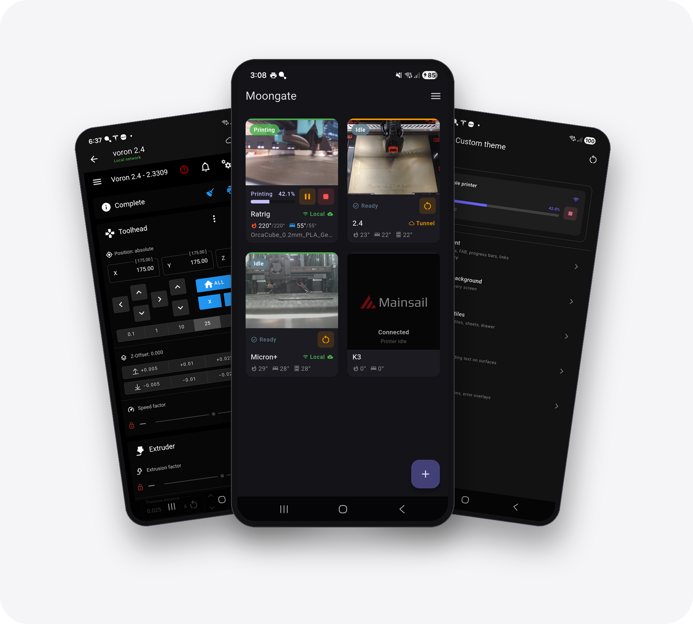
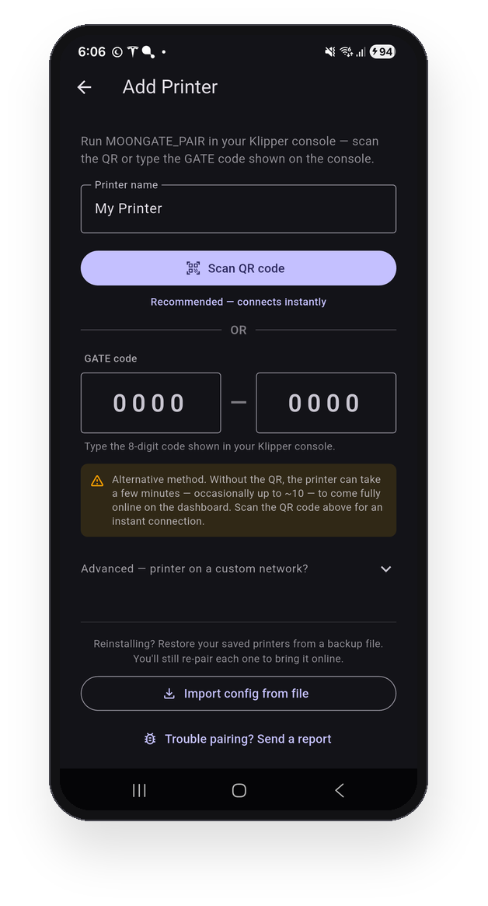
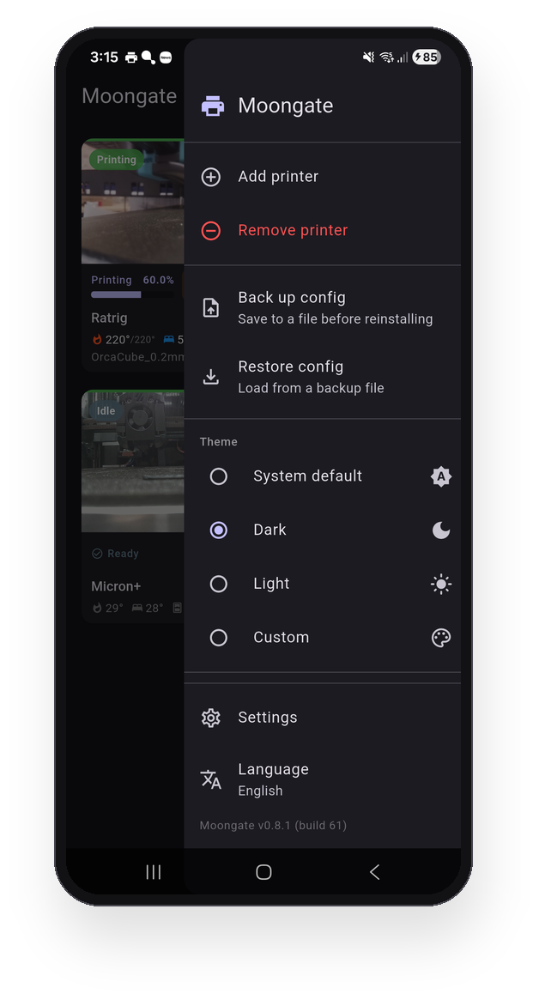
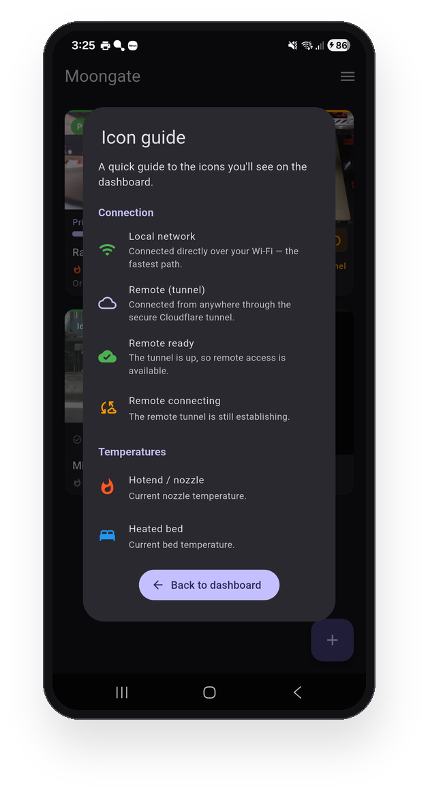
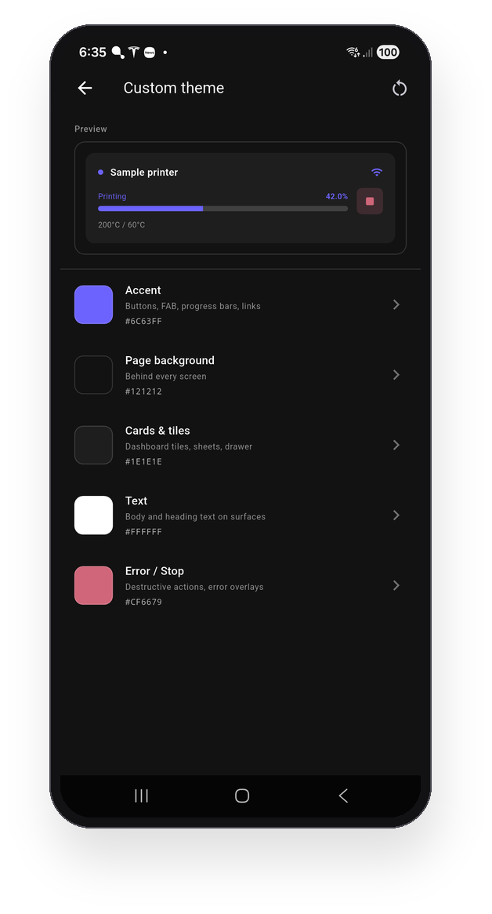
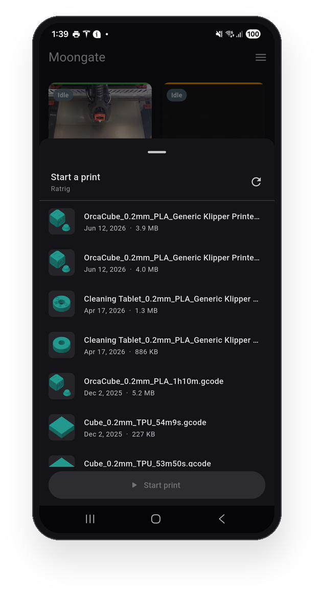
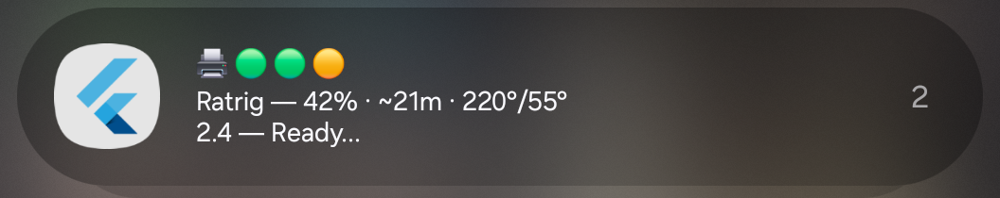
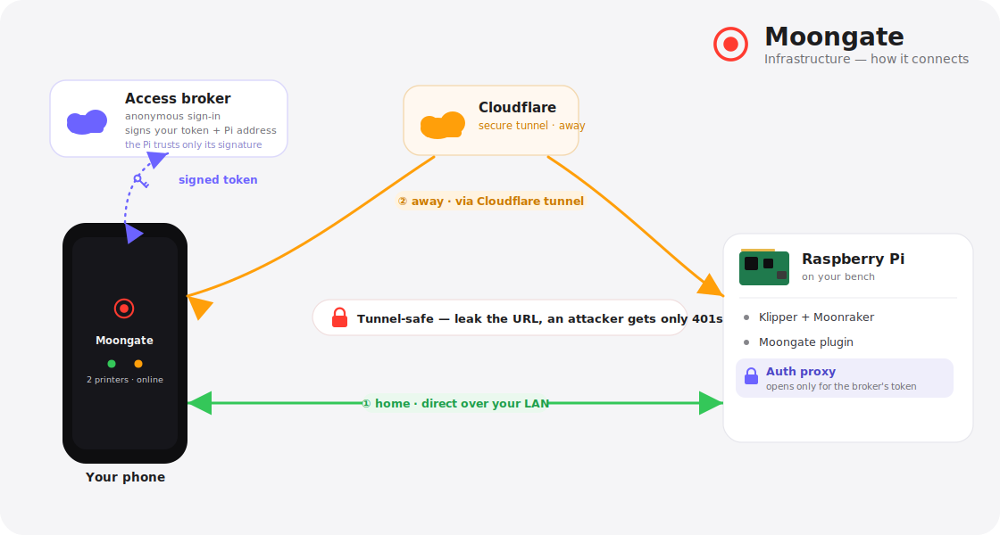

<div align="center">


# Moongate

### One app. Your Klipper printer. Anywhere.

[](https://github.com/PEEKYPAUL/Moongate/releases/latest)
[](LICENSE)
[](#quick-start)



Free, open-source Android control for your **Klipper 3D printer** — live webcam, print controls, temperatures, and the complete Mainsail/Fluidd UI — over home WiFi and **automatically over the internet** when you're away. No Tailscale, no VPN, no port forwarding, no subscriptions.

<a href="https://github.com/PEEKYPAUL/Moongate/releases/latest"></a>

</div>

---

## Contents

- [Features](#features)
- [Screenshots](#screenshots)
- [Quick start](#quick-start)
- [How it works](#how-it-works)
- [Documentation](#documentation)
- [Buy me a coffee](#buy-me-a-coffee)
- [License](#license)

---

## Features

- 📊 **Fleet dashboard** — live webcam thumbnails (pick the refresh rate to balance smoothness vs. data), print progress matched to Mainsail's estimate, temperatures, chamber sensor, and a per-printer status badge. Tiles auto-sort by activity so whatever's printing floats to the top — or turn that off and **drag them into your own order**, which sticks and travels in your backups.
- 📷 **External cameras** — point a tile at a camera that isn't wired into Klipper (an old phone as a webcam, a network IP cam). Cameras already configured in Mainsail are auto-detected; or set one by hand with the tile's gear. Works on Wi-Fi and remotely through the tunnel (home-network cameras), and a menu toggle hides the gears.
- 🎛️ **Print controls** — pause, resume, and stop from the tile, plus a one-tap firmware restart for idle or errored printers.
- 💡 **Lighting control** — drive your printer's lights from the dashboard. Set each printer's on/off (or single toggle) macro under the **Lighting** menu, then tap the bulb on its camera. Point it at the light's Klipper object and the bulb shows the **real** on/off state, even when you switch the light elsewhere.
- 📂 **Print files on the printer** — tap the folder button on a ready printer to browse the G-code already saved on it, shown with slicer **thumbnails**, newest first. Pick one and **Start print** with a confirm tap — no slicer, no re-upload.
- 🖥️ **Full Mainsail / Fluidd UI** — tap a tile to open the complete web UI in-app; whichever you run is auto-detected. It **stays loaded in the background, so re-opening a printer is instant** instead of reloading every time — a big difference over the tunnel. A built-in full-screen **camera view** (top-bar icon) keeps the feed working when you're away — even for an external camera the embedded page can't load over mobile data.
- 📡 **Auto local ↔ remote** — tries home WiFi first every poll, falls back to the Cloudflare tunnel within ~2s when you're away, and flips back to "Local" the moment you're home.
- 🔔 **Print notifications** — opt-in live fleet status in your notification shade — per-printer progress, ETA, temperatures and heat-up — with start / finish / pause / error alerts, and a configurable refresh interval. Off by default.
- 🔒 **App lock** — optional PIN + biometric (fingerprint/face) on launch, with configurable auto-lock and screenshot protection. Off by default.
- 🌍 **8 languages** — fully translated into English, German, French, Spanish, Italian, Simplified Chinese, Russian, and Polish; choose on first launch or anytime from the menu.
- 🎨 **Themes & layout** — System / Light / Dark / fully **Custom** colours, a 1–3 column grid, font scaling, and optional landscape.
- 💾 **Backup & restore** — save your printers and settings to a file; restoring after a reinstall, or on a new phone, brings your printers **back online with no re-pairing**.

> 🔐 **Hardened remote access** — every internet-facing request is gated by a short-lived signed token. Leaking the tunnel URL alone gives an attacker nothing but flat `401`s, with no Mainsail/Moonraker fingerprint. [How it works ›](#how-it-works)

---

## Screenshots

<div align="center">
  
  
  
  
  
</div>

<div align="center">
<br/>

<br/><sub><em>Optional print notifications — live fleet status &amp; start / finish / error alerts, right in your notification shade.</em></sub>
</div>

---

## Quick start

Three steps: install the Pi plugin, install the app, pair.

### 1. Install the Pi plugin

SSH into your Pi and run:

```bash
curl -fsSL https://raw.githubusercontent.com/PEEKYPAUL/moongate/master/klipper-plugin/install.sh | bash
```

This installs the plugin, the `MOONGATE_PAIR` macro, the QR pairing page, the auth proxy, and the Cloudflare tunnel, then restarts Moonraker. Future updates appear in **Mainsail → Software Updates → Moongate**.

<details>
<summary><b>Requirements &amp; custom HTTP port</b></summary>

<br>

**Requirements:** a Raspberry Pi running Klipper + Moonraker + Mainsail or Fluidd (standard KIAUH / MainsailOS / FluiddPI). Tested on aarch64 (Pi 4/5) and armv7l (Pi 3).

**Non-standard port?** Moonraker usually serves on port 80 (the installer's default). If yours is elsewhere, tell the installer:

```bash
MOONGATE_PORT=8080 bash -c "$(curl -fsSL https://raw.githubusercontent.com/PEEKYPAUL/moongate/master/klipper-plugin/install.sh)"
```

In the app's pair screen, set the **Port** field to match (leave it blank for 80).

</details>

### 2. Install the app

[](https://github.com/PEEKYPAUL/Moongate/releases/latest)

Android only. Enable **Install from unknown sources** for your browser or file manager, then open the APK. Every release lives on the [Releases page](https://github.com/PEEKYPAUL/Moongate/releases).

### 3. Pair

1. Run **`MOONGATE_PAIR`** in the Klipper / Mainsail console.
2. On a device on the **same WiFi as your Pi**, open `http://<your-pi-ip>/moongate-pair.html` — a QR appears.
3. In the app, tap **+ → Scan QR** and point the camera at it. Done — your printer lands on the dashboard.

No working camera? Type the **`GATE-XXXX-XXXX`** code shown in the console instead.

> **How quickly does it connect? Scanning the QR is instant.**
> - ✅ **Scan the QR (recommended)** — an **instant local connection**: your printer is on the dashboard in about a second, because the QR hands the app your Pi's local address directly. Remote access over the secure tunnel keeps **building in the background** — you never wait on it.
> - ⚠️ **GATE code** — there's no instant local hand-off, so the printer doesn't appear until the **Cloudflare tunnel** has finished building (that's what carries the connection). Usually under a minute — a little longer right after a Pi reboot. It isn't stuck; give it a moment, or scan the QR for an instant connection.

> Pairing is LAN-only by design: nothing to port-forward, no URL to share. Reinstalling or switching phones? **Back up your config first** — restoring it brings your printers back online without re-pairing. See **[Updating &amp; removing](docs/managing-moongate.md)**.

---

## How it works

<div align="center">

</div>

Your Pi runs Klipper, Moonraker, the Moongate plugin, and an **auth proxy** that gates everything reachable from the internet. A minimal **access broker** handles anonymous sign-in (no email, no password) and tracks the current tunnel URL; the app fetches a fresh signed token before each request and tries home WiFi first, then the tunnel.

**The headline:** leaking the tunnel URL alone gives an attacker nothing — every path through it returns `401` without revealing what's underneath. Full threat model in [SECURITY.md](SECURITY.md); code-level detail in [ARCHITECTURE.md](ARCHITECTURE.md).

---

## Documentation

| Document | What's inside |
|---|---|
| [Updating &amp; removing](docs/managing-moongate.md) | Updating the app &amp; plugin, reinstalling / moving to a new phone, full uninstall |
| [DEVELOPMENT.md](DEVELOPMENT.md) | Building from source, repo layout, debugging, release signing, CI |
| [ARCHITECTURE.md](ARCHITECTURE.md) | Code structure, state management, data-flow walkthroughs, design decisions |
| [SECURITY.md](SECURITY.md) | Threat model, what the tunnel does and doesn't expose, the empirical verification, vulnerability reporting |
| [TROUBLESHOOTING.md](TROUBLESHOOTING.md) | Common failure modes — offline tiles, tunnel issues, pairing failures — each with copy-paste diagnostics |
| [CHANGELOG.md](CHANGELOG.md) | Every release with a one-line summary of what changed and why |

> **Building from source?** `cd mobile && flutter pub get && flutter build apk --release`. Full developer workflow in [DEVELOPMENT.md](DEVELOPMENT.md).

---

## Buy me a coffee

Moongate is free, open source, and built in my spare time for the Klipper community — no ads, no subscriptions, no data harvesting. If it's earned a spot on your phone, you can buy me a coffee to say thanks. Every contribution goes straight back into the project: test hardware, the cloud service that keeps remote access working, and the time to keep shipping features.

Thank you for being part of it 💜

<p align="center">
  <a href="https://www.paypal.com/donate/?hosted_button_id=WCWAZKQ7WKQB4">
    
  </a>
</p>

---

## License

**PolyForm Noncommercial License 1.0.0** — see [LICENSE](LICENSE) for the full text.

- ✅ Free to read, build, self-host, modify, and share for **non-commercial** use — including charities, schools, and public / research / government institutions.
- ❌ Selling Moongate, charging for access, or bundling it in a paid product needs a **separate written licence**.

Want to use Moongate commercially? [Open an issue](https://github.com/PEEKYPAUL/Moongate/issues/new) or contact [@PEEKYPAUL](https://github.com/PEEKYPAUL) to discuss terms.

---

<div align="center">
<sub>Created by <a href="https://github.com/PEEKYPAUL">Paul Sharman</a></sub>
</div>
