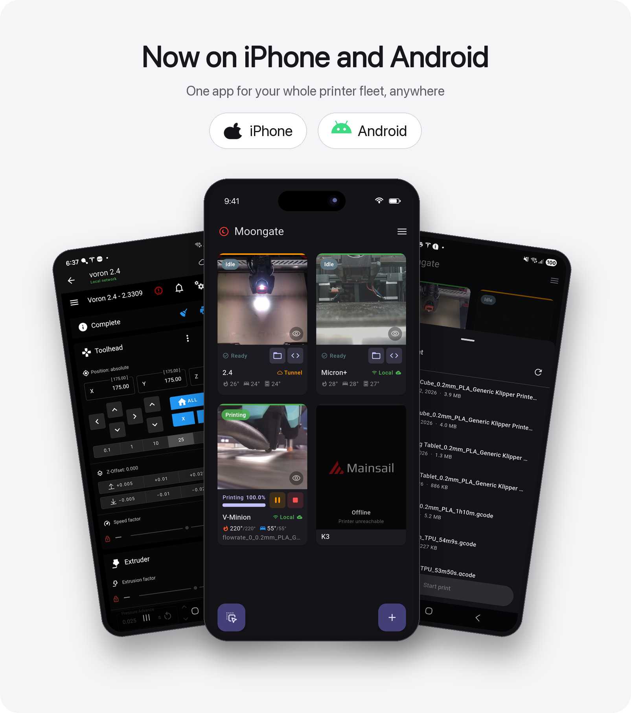

<div align="center">


# Moongate

### One app. Your Klipper printer. Anywhere.

[](https://github.com/PEEKYPAUL/Moongate/releases/latest)
[](LICENSE)
[](#quick-start)
[](https://apps.apple.com/gb/app/moongate-klipper-control/id6785038887)



Free, open-source **iPhone and Android** control for your **Klipper 3D printer** - live webcam, print controls, temperatures, and the complete Mainsail/Fluidd UI - over home WiFi and **automatically over the internet** when you're away. Zero setup, no port forwarding, no subscriptions.

**Prefer your own infrastructure? Run it your way.** The cloud-free **Direct (LAN/VPN)** mode talks straight to your printer over your network - or your own **WireGuard / Tailscale VPN** when you're out - and never touches the internet. [See how the two modes compare ›](#run-it-your-way)

<a href="https://apps.apple.com/gb/app/moongate-klipper-control/id6785038887"></a>
<a href="https://github.com/PEEKYPAUL/Moongate/releases/latest"></a>

**🍎 Now on iPhone.** The iPhone app is [live on the App Store](https://apps.apple.com/gb/app/moongate-klipper-control/id6785038887), built from the same codebase as Android.

</div>

---

## Contents

- [Features](#features)
- [Screenshots](#screenshots)
- [Quick start](#quick-start)
- [Run it your way](#run-it-your-way)
- [How it works](#how-it-works)
- [Documentation](#documentation)
- [Buy me a coffee](#buy-me-a-coffee)
- [License](#license)

---

## Features

- 📊 **Fleet dashboard** - live webcam thumbnails (the feed rate follows your network automatically - smoother on Wi-Fi, throttled on mobile data to save it - with separate rates you can tune for each, or switch a feed off entirely), print progress that matches what Mainsail shows, temperatures, a chamber sensor, and a per-printer status badge. Tiles auto-sort by activity so whatever's printing floats to the top - or turn that off and **drag them into your own order**, which sticks and travels in your backups. **Hide a printer's webcam** to shrink it to a compact tile, and the grid packs full and compact tiles together so the printers you're not watching take up less room.
- 🧰 **Multi-toolhead & tool changers** - IDEX and tool-changer printers (klipper-toolchanger / StealthChanger) are fully supported. The dashboard shows **every hotend** as its own **T0 / T1 / …** chip with the **active tool highlighted**, **preheat** sets a target for each tool at once (plus the bed), and the print notification lists **all** their live hotend temperatures. The Pi plugin folds the whole toolhead set into the single secure status call the app already reads, so detection stays reliable on Wi-Fi, over the tunnel, and on a VPN.
- 📷 **External cameras** - point a tile at a camera that isn't wired into Klipper (an old phone as a webcam, a network IP cam, a **go2rtc** feed). Cameras already configured in Mainsail are auto-detected - including **go2rtc / WebRTC** cameras (v0.9.52+, shown as live stills) - or set one by hand with the tile's gear. Works on Wi-Fi and remotely through the tunnel (home-network cameras), and a menu toggle hides the gears.
- 🎛️ **Print controls** - pause, resume, and stop from the tile, plus a one-tap firmware restart for idle or errored printers. An **emergency-stop** triangle on every online tile halts the machine instantly (Klipper `M112`) on a **double-tap** - and once it's stopped, the triangle turns into a one-tap **restart** to bring the printer back. If a printer has a Moonraker **power device**, a power button on its tile switches it **on or off** (with a confirm) - and it works even while the printer is off, so you can wake it remotely. No power device? Point the printer at its own **power macro** instead (Advanced Power Switch) and the same button drives that. There's also an optional **Power all machines** button for the top bar (switch it on in the menu) that powers your whole fleet on or off at once, driving each printer however it's set up (a power device or a power macro), showing exactly which ones will switch, and always leaving a printer that's currently printing on.
- 💡 **Lighting control** - drive your printer's lights from the dashboard. Set each printer's on/off (or single toggle) macro under the **Lighting** menu, then tap the bulb on its camera. Point it at the light's Klipper object and the bulb shows the **real** on/off state, even when you switch the light elsewhere.
- 📂 **Print files on the printer** - tap the folder button on a ready printer to browse the G-code already saved on it, shown with slicer **thumbnails**, newest first. Pick one and **Start print** with a confirm tap - no slicer, no re-upload.
- 🖥️ **Full Mainsail / Fluidd UI** - tap a tile to open the complete web UI in-app; whichever you run is auto-detected. Every printer's page is **warmed in the background the moment the app starts and then kept loaded, so even the first time you open a printer it's instant** - no "Initializing…" reload, a big difference over the tunnel. A built-in full-screen **camera view** - open it from the top-bar icon, the tile's eye button, or just **press and hold any tile's camera** - runs at the camera's **full frame rate** with pinch-to-zoom, and keeps the feed working when you're away - even for an external camera the embedded page can't load over mobile data.
- 📡 **Auto local ↔ remote** - tries home WiFi first every poll, falls back to the Cloudflare tunnel within ~2s when you're away, and flips back to "Local" the moment you're home. Printers that are **switched off cost almost nothing in the background** - the dashboard and the print notifications both stop reaching out to them until they're back online - so it's easy on mobile data and battery. Prefer to stay off the internet entirely? An optional **Local only** switch in the top bar (enable its button in the menu) turns remote connections off with one tap - only printers on your own network connect until you tap it again.
- 🔌 **Run it your way - Direct (LAN/VPN) mode** - a fully **cloud-free** way to run Moongate: install the Pi in LAN-only mode, add the printer by QR or address, and the app talks **straight to Moonraker** on your network - no account, no tunnel, nothing ever leaves your LAN. Away from home you connect over **your own VPN** (WireGuard, Tailscale). Existing printers **switch between cloud and Direct** from their edit dialog, no re-pairing. Honest trade-off: no print notifications in Direct mode, and remote access is your VPN's job. [Details ›](#run-it-your-way)
- 🔔 **Print notifications** - opt-in live fleet status in your notification shade - per-printer progress, the projected **finish time**, temperatures and heat-up - with start / finish / pause / error alerts and a configurable refresh interval. **Choose which details show and drag them into the order you want**, and the roster follows your dashboard's order (your **Auto-arrange by status** setting). A **pause/play button** in the top bar suspends the background checks with one tap when your printers will be off for a while (saving battery), then resumes them when you tap it again. Off by default.
- 🔒 **App lock** - optional PIN + biometric (fingerprint/face) on launch, with configurable auto-lock and screenshot protection. Off by default.
- 🎓 **Guided tour** - an optional in-app walkthrough, offered once you've added your first printer, that points out each part of the app live: the connection bars and what they mean (including the "tunnel still building" marker you see just after pairing), the temperatures and the double-tap emergency stop, the webcam and preheat, and the main options in the menu. Step forward or back, end it any time, and re-run it from the bottom of the menu.
- 🌍 **9 languages** - fully translated into English, German, French, Spanish, Italian, Simplified Chinese, Russian, Polish, and Brazilian Portuguese (community-contributed); choose on first launch or anytime from the menu.
- 🎨 **Themes & layout** - **Light / Dark / fully Custom** colours, plus **Phone colours** on **Android 12+** that follow your system **Material You** wallpaper palette and light/dark setting. Custom adds your own **dashboard background image** and adjustable **tile opacity**. Restyle the whole app's text with a **36-font picker** (grouped by style), and there's a 1-3 column grid, display-size scaling, optional landscape, and a switch to **hide the floating add / reorder buttons** at the bottom (menu → Dashboard Layout) when you have a lot of printers.
- 💾 **Backup & restore** - save your printers and settings to a file; restoring after a reinstall, or on a new phone, brings your printers **back online with no re-pairing**. Restoring **adds to** what's already on your dashboard - it never removes printers unless you choose to match the backup exactly.
- 🔄 **In-app updates** - when a new version lands, update right inside the app: it downloads with a progress bar and installs in place - no browser detour, nothing re-paired. The dashboard also keeps the **printer side** current: a printer running an out-of-date Moongate plugin shows a small **update icon on its tile** until it's updated - tap it and (on recent plugins) **one tap updates the plugin straight from your phone**; older plugins get pointed at Mainsail's Software Updates panel.

> 🔐 **Hardened remote access** - every internet-facing request is gated by a short-lived signed token. Leaking the tunnel URL alone gives an attacker nothing but flat `401`s, with no Mainsail/Moonraker fingerprint. [How it works ›](#how-it-works)

---

## Screenshots

<div align="center">
  
  
  
  
  
</div>

<div align="center">
<br/>

<br/><sub><em>Optional print notifications - live fleet status &amp; start / finish / error alerts, right in your notification shade.</em></sub>
</div>

---

## Quick start

Three steps: install the Pi plugin, install the app, pair.

### 1. Install the Pi plugin

SSH into your Pi and run:

```bash
curl -fsSL https://raw.githubusercontent.com/PEEKYPAUL/Moongate/master/klipper-plugin/install.sh | bash
```

The installer asks how your phone will connect: **1) Moongate cloud** (the default - remote access from anywhere) or **2) Direct (LAN/VPN)** (cloud-free; [see how the two compare](#run-it-your-way)). With the default it installs the plugin, the `MOONGATE_PAIR` macro, the QR pairing page, the auth proxy, and the Cloudflare tunnel, then restarts Moonraker. Future updates appear in **Mainsail → Software Updates → Moongate**.

<details>
<summary><b>Requirements &amp; custom HTTP port</b></summary>

<br>

**Requirements:** a Raspberry Pi running Klipper + Moonraker + Mainsail or Fluidd (standard KIAUH / MainsailOS / FluiddPI). Tested on aarch64 (Pi 4/5) and armv7l (Pi 3).

**Non-standard port?** Moonraker usually serves on port 80 (the installer's default). If yours is elsewhere, tell the installer:

```bash
MOONGATE_PORT=8080 bash -c "$(curl -fsSL https://raw.githubusercontent.com/PEEKYPAUL/Moongate/master/klipper-plugin/install.sh)"
```

In the app's pair screen, set the **Port** field to match (leave it blank for 80).

**LAN-only (own VPN, no tunnel)?** If you reach your printer over your own VPN / WireGuard and don't want an outbound Cloudflare tunnel or external exposure, install in LAN-only mode. It keeps Moonraker on the LAN (`0.0.0.0`) and skips cloudflared, the auth proxy, and the tunnel service. The plugin, `MOONGATE_PAIR` macro, and mDNS advertisement are still installed, and a later cloud re-install enables remote access.

**The installer asks.** Run it interactively (the normal `curl | bash` one-liner counts) and it offers the choice - answer `2` for Direct (LAN/VPN):

```
How will your phone connect to this printer?
    1) Moongate cloud   - remote access from anywhere (secure tunnel)
    2) Direct (LAN/VPN) - home network / your own VPN only, no cloud
```

On a box that already runs LAN-only the default keeps it LAN-only, so pressing Enter never converts your mode. To preselect an answer and skip the question (scripts, headless installs):

```bash
# LAN-only, piped
MOONGATE_LAN_ONLY=1 bash -c "$(curl -fsSL https://raw.githubusercontent.com/PEEKYPAUL/Moongate/master/klipper-plugin/install.sh)"
# LAN-only, from a local checkout
bash install.sh --lan-only
# cloud, never prompt (automation)
MOONGATE_LAN_ONLY=0 bash -c "$(curl -fsSL https://raw.githubusercontent.com/PEEKYPAUL/Moongate/master/klipper-plugin/install.sh)"
```

Choosing LAN-only on a box that already has the tunnel stack retires it (disables the tunnel + auth proxy) and converges to LAN-only.

In the app, add a LAN-only printer with **Add printer → Direct (LAN/VPN)** - scan the QR from `MOONGATE_PAIR` or type the printer's address. A LAN-only box can also be paired through the cloud as normal (while it has internet); Direct mode is for the fully cloud-free / internet-isolated case. Two networking notes:

- **`trusted_clients` must cover your phone.** The app talks to Moonraker directly, so the phone's subnet needs to be in Moonraker's `[authorization] trusted_clients`. Home WiFi and WireGuard's usual `10.x` range typically already are; **Tailscale's `100.64.0.0/10` usually is not** - add it or Moonraker answers 401 before Moongate ever runs.
- **Give the Pi a fixed address.** The app stores the address a Direct printer was added with, so use a DHCP reservation (or static IP) - if the Pi's IP changes you'd have to re-add it.

Direct-mode printers work fully offline, but skip everything cloud-backed: no print notifications, and away from home the app only reaches them through your own VPN.

</details>

### 2. Install the app

[](https://apps.apple.com/gb/app/moongate-klipper-control/id6785038887)
[](https://github.com/PEEKYPAUL/Moongate/releases/latest)

**iPhone** - get it on the [App Store](https://apps.apple.com/gb/app/moongate-klipper-control/id6785038887).

**Android** - enable **Install from unknown sources** for your browser or file manager, then open the APK. Every release lives on the [Releases page](https://github.com/PEEKYPAUL/Moongate/releases).

### 3. Pair

1. Run **`MOONGATE_PAIR`** in the Klipper / Mainsail console.
2. On a device on the **same WiFi as your Pi**, open `http://<your-pi-ip>/moongate-pair.html` - a QR appears.
3. In the app, tap **+ → Scan QR** and point the camera at it. Done - your printer lands on the dashboard.

No working camera? Type the **`GATE-XXXX-XXXX`** code shown in the console instead.

> **How quickly does it connect? Scanning the QR is instant.**
> - ✅ **Scan the QR (recommended)** - an **instant local connection**: your printer is on the dashboard in about a second, because the QR hands the app your Pi's local address directly. Remote access over the secure tunnel keeps **building in the background** - you never wait on it.
> - ⚠️ **GATE code** - there's no instant local hand-off, so the printer doesn't appear until the **Cloudflare tunnel** has finished building (that's what carries the connection). Usually under a minute - a little longer right after a Pi reboot. It isn't stuck; give it a moment, or scan the QR for an instant connection.

> Pairing is LAN-only by design: nothing to port-forward, no URL to share. Reinstalling or switching phones? **Back up your config first** - restoring it brings your printers back online without re-pairing. See **[Updating &amp; removing](docs/managing-moongate.md)**.

---

## Run it your way

Moongate gives every printer a choice of two connections - and you can mix them freely on one dashboard.

| | ☁️ Moongate cloud (default) | 🔌 Direct (LAN/VPN) |
|---|---|---|
| Setup | pair once with the QR / GATE code | pick **Direct** when the installer asks, add by QR or address |
| Away from home | automatic - secure tunnel, zero config | through **your own VPN** (WireGuard, Tailscale) |
| Print notifications | ✅ | ❌ (no cloud to send them) |
| What touches the cloud | pairing, a heartbeat, short-lived tokens | **nothing - zero calls, ever** |
| Needs internet | to pair and for the tunnel | **never - works fully offline** |
| Best for | most people - it just works | VPN owners, isolated networks, zero-cloud setups |

Switch an existing printer between modes anytime from its edit dialog - no re-pairing. If you later want a Direct printer on the cloud, re-run the installer normally and pair it; the app absorbs the old tile automatically. Networking notes for Direct mode (Moonraker's `trusted_clients`, give the Pi a fixed address) are in the [LAN-only install section](#quick-start) above.

---

## How it works

<div align="center">

</div>

**Route 1 - Moongate cloud.** Your Pi runs Klipper, Moonraker, the Moongate plugin, and an **auth proxy** that gates everything reachable from the internet. A minimal **access broker** handles anonymous sign-in (no email, no password) and tracks the current tunnel URL; the app fetches a fresh signed token before each request and tries home WiFi first, then the tunnel.

**The headline:** leaking the tunnel URL alone gives an attacker nothing - every path through it returns `401` without revealing what's underneath. Full threat model in [SECURITY.md](SECURITY.md); code-level detail in [ARCHITECTURE.md](ARCHITECTURE.md).

**Route 2 - Direct (LAN/VPN).** No broker, no tunnel, no heartbeats: the app talks straight to Moonraker on your network - or across your own VPN - gated by Moonraker's `trusted_clients`, exactly like Mainsail in a desktop browser. The Pi makes **zero outbound calls** and the whole thing works with no internet at all.

---

## Documentation

| Document | What's inside |
|---|---|
| [Updating &amp; removing](docs/managing-moongate.md) | Updating the app &amp; plugin, reinstalling / moving to a new phone, full uninstall |
| [DEVELOPMENT.md](DEVELOPMENT.md) | Building from source, repo layout, debugging, release signing, CI |
| [ARCHITECTURE.md](ARCHITECTURE.md) | Code structure, state management, data-flow walkthroughs, design decisions |
| [SECURITY.md](SECURITY.md) | Threat model, what the tunnel does and doesn't expose, the empirical verification, vulnerability reporting |
| [TROUBLESHOOTING.md](TROUBLESHOOTING.md) | Common failure modes - offline tiles, tunnel issues, pairing failures - each with copy-paste diagnostics |
| [CHANGELOG.md](CHANGELOG.md) | Every release with a one-line summary of what changed and why |
| [Privacy policy](https://peekypaul.github.io/Moongate/privacy-policy.html) | What data the app handles and why - anonymous, no analytics, no tracking, no data sold |

> **Building from source?** `cd mobile && flutter pub get && flutter build apk --release --flavor github --dart-define=MOONGATE_CHANNEL=github`. Full developer workflow in [DEVELOPMENT.md](DEVELOPMENT.md).

---

## Buy me a coffee

Moongate is free, open source, and built in my spare time for the Klipper community - no ads, no subscriptions, no data harvesting. If it's earned a spot on your phone, you can buy me a coffee to say thanks. Every contribution goes straight back into the project: test hardware, the cloud service that keeps remote access working, and the time to keep shipping features.

Thank you for being part of it 💜

<p align="center">
  <a href="https://www.paypal.com/donate/?hosted_button_id=WCWAZKQ7WKQB4">
    
  </a>
</p>

---

## License

**PolyForm Noncommercial License 1.0.0** - see [LICENSE](LICENSE) for the full text.

- ✅ Free to read, build, self-host, modify, and share for **non-commercial** use - including charities, schools, and public / research / government institutions.
- ❌ Selling Moongate, charging for access, or bundling it in a paid product needs a **separate written licence**.

Want to use Moongate commercially? [Open an issue](https://github.com/PEEKYPAUL/Moongate/issues/new) or contact [@PEEKYPAUL](https://github.com/PEEKYPAUL) to discuss terms.

---

<div align="center">
<sub>Created by <a href="https://github.com/PEEKYPAUL">Paul Sharman</a></sub>
</div>
